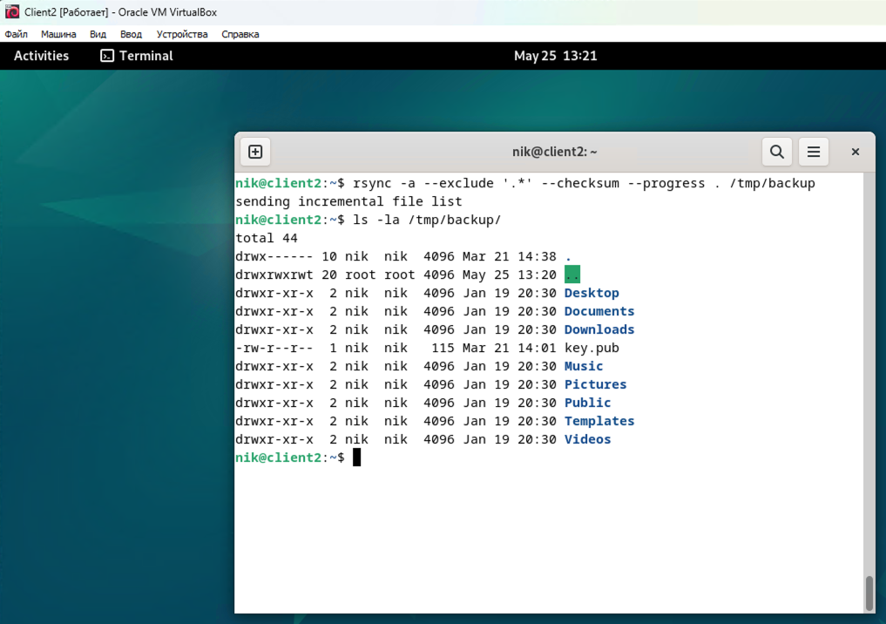
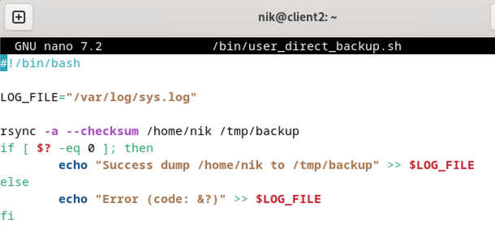
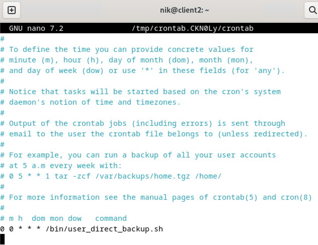
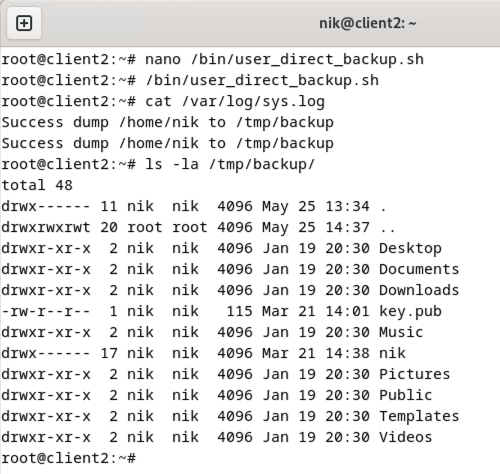

# Домашнее задание к занятию "`Резервное копирование`" - `Кошель Николай Павлович`

### Задание 1
    ```
    rsync -a --exclude '.*' --checksum /home/nik /tmp/backup
    ```


### Задание 2
    ```
    #!/bin/bash

    LOG_FILE="/var/log/sys.log"

    rsync -a --checksum /home/nik /tmp/backup
    if [ $? -eq 0 ]; then
        echo "Success dump /home/niko /tmp/backup" >> $LOG_FILE
    else
        echo "Error (code: &?)" >> $LOG_FILE
    fi
    ```


